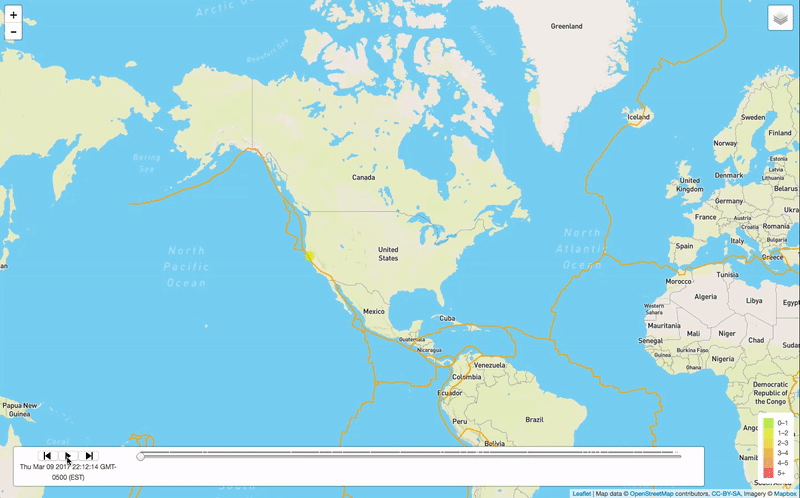

## Background

Welcome to the United States Geological Survey, or USGS for short! The USGS is responsible for providing scientific data about natural hazards, the health of our ecosystems and environment; and the impacts of climate and land-use change. Their scientists develop new methods and tools to supply timely, relevant, and useful information about the Earth and its processes. As a new hire, you will be helping them out with an exciting new project!

The USGS is interested in building a new set of tools that will allow them visualize their earthquake data. They collect a massive amount of data from all over the world each day, but they lack a meaningful way of displaying it. Their hope is that being able to visualize their data will allow them to better educate the public and other government organizations (and hopefully secure more funding..) on issues facing our planet.

## Your Task

### Step 1: Basic Visualization

Your first task is to visualize an earthquake data set.

1. **Get your data set**

   

   The USGS provides earthquake data in a number of different formats, updated every 5 minutes. Visit the [USGS GeoJSON Feed](http://earthquake.usgs.gov/earthquakes/feed/v1.0/geojson.php) page and pick a data set to visualize. When you click on a data set, for example 'All Earthquakes from the Past 7 Days', you will be given a JSON representation of that data. You will be using the URL of this JSON to pull in the data for our visualization.

   

2. **Import & Visualize the Data**

   Create a map using Leaflet that plots all of the earthquakes from your data set based on their longitude and latitude.

   * Your data markers should reflect the magnitude of the earthquake in their size and color. Earthquakes with higher magnitudes should appear larger and darker in color.

   * Include popups that provide additional information about the earthquake when a marker is clicked.

   * Create a legend that will provide context for your map data.

   * Your visualization should look something like the map above.

- - -

### Step 2: More Data

The USGS wants you to plot a second data set on your map to illustrate the relationship between tectonic plates and seismic activity. You will need to pull in a second data set and visualize it along side your original set of data. Data on tectonic plates can be found at <https://github.com/fraxen/tectonicplates>.

In this step we are going to..

* Plot a second data set on our map.

* Add a number of base maps to choose from as well as separate out our two different data sets into overlays that can be turned on and off independently.

* Add layer controls to our map.

- - -

### Step 3: Time Keeps on Ticking

Many people don't know how much seismic activity is happening around them all the time. Did you know that Southern California has over 10,000 earthquakes each year alone? The USGS wants you to create a map that will visualize just how many earthquakes happen over the course of a day/week.

* Your task is to use a Leaflet plugin (they can be found at <http://leafletjs.com/plugins.html>) to visualize your earthquake as it takes place over a period of time.

- - -

### Bonus: Above and Beyond

You're so excited to be in your new position you really want to do something that will blow them away. You came up with two ideas of ways to go above and beyond:

* Find another set of geospatial data that you can use to show a new correlation or insight about our existing earthquake data.

* Use additional plug-ins from the [Leaflet Documentation](http://leafletjs.com/plugins.html) to further visualize our data in a unique way.

  * Heatmap
    

  * Data Clustering
    

### Assessment

Your final product will be assessed on the following metrics:

* Completion of all steps in chosen level

* Visual attraction

* Professionalism

**Good luck!**

## Copyright

Coding Boot Camp (C) 2016. All Rights Reserved.
